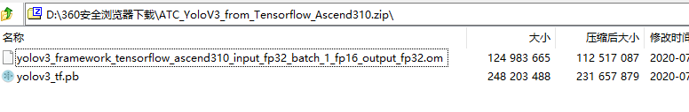
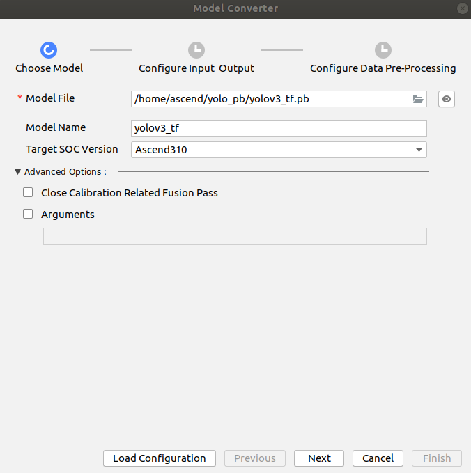
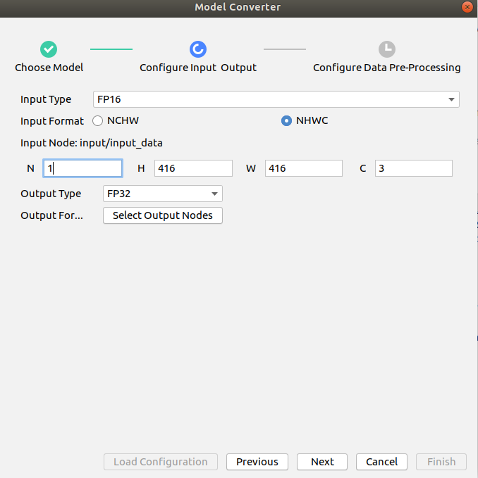
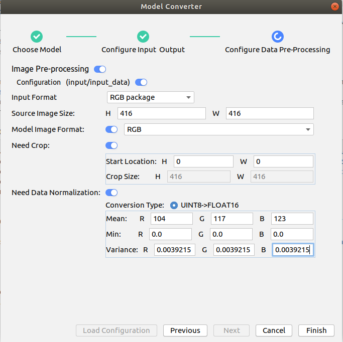
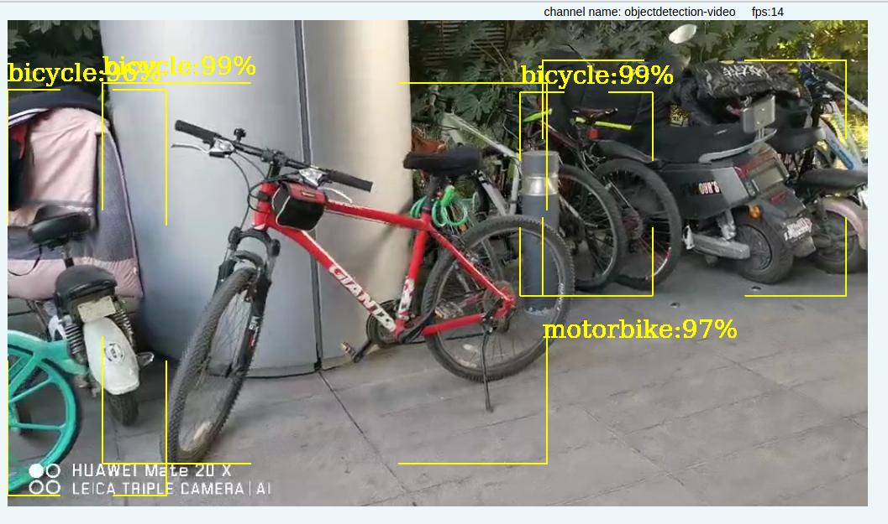

# 目标检测推理（yolov3模型在Atlas 200 DK上推理）

#### 介绍

基于tensorflow的pb模型转换得om模型在Atlas 200 DK上C++推理代码，支持rtsp视频流输入和MP4视频文件输入

该推理代码：https://gitee.com/ascend/samples/tree/master/objectdetection_video/for_atlas200dk_1.7x.0.0_c++ 基于caffe模型转换的om模型进行推理

本代码库基于上述代码修改，区别在于后处理不同

后处理借鉴了此代码库：https://gitee.com/ascend/samples/tree/dev/c++/level2_simple_inference/2_object_detection/YOLOV3_VOC_detection_picture

#### 代码目录结构
```
├── CMakeLists.txt
├── data
│   └── detection.mp4
├── inc
│   ├── model_process.h
│   ├── object_detect.h
│   ├── sample_process.h
│   └── utils.h
├── model
│   └── yolov3_tf.om -> /home/ascend/modelzoo/yolov3_tf/device/yolov3_tf.om
├── out
├── script
│   └── presenterserver
│       ├── common
│       │   ├── app_manager.py
│       │   ├── channel_handler.py
│       │   ├── channel_manager.py
│       │   ├── __init__.py
│       │   ├── parameter_validation.py
│       │   ├── presenter_message_pb2.py
│       │   └── presenter_socket_server.py
│       ├── display
│       │   ├── config
│       │   │   ├── config.conf
│       │   │   └── logging.conf
│       │   ├── __init__.py
│       │   ├── src
│       │   │   ├── config_parser.py
│       │   │   ├── display_server.py
│       │   │   ├── __init__.py
│       │   │   └── web.py
│       │   └── ui
│       │       ├── static
│       │       │   ├── css
│       │       │   │   ├── base.css
│       │       │   │   ├── dialog.css
│       │       │   │   ├── list.css
│       │       │   │   └── testvideo.css
│       │       │   ├── images
│       │       │   │   ├── loading.gif
│       │       │   │   ├── logo.png
│       │       │   │   ├── u1.png
│       │       │   │   ├── u2.png
│       │       │   │   ├── u3.png
│       │       │   │   ├── u4.png
│       │       │   │   ├── u5.png
│       │       │   │   └── u6.png
│       │       │   └── js
│       │       │       ├── dialog.js
│       │       │       ├── dialog.min.js
│       │       │       ├── index.js
│       │       │       ├── jquery-1.10.2.min.js
│       │       │       ├── socket.io.js
│       │       │       └── socket.io.min.js
│       │       └── templates
│       │           ├── home.html
│       │           └── view.html
│       ├── __init__.py
│       ├── prepare_presenter_server.sh
│       ├── presenter_server.py
│       ├── README
│       └── requirements
└── src
    ├── acl.json
    ├── CMakeLists.txt
    ├── main.cpp
    ├── model_process.cpp
    ├── object_detect.cpp
    └── utils.cpp

```
#### 模型转换

下载华为ModelZoo上的tensorflow模型：https://www.huaweicloud.com/ascend/resources/modelzoo/Models/5cb8d2255070439d94068b7935570c43

下载的压缩包里包括pb模型及om模型（我直接使用om模型不能推理，因此自己基于pb转换的）



模型转换：





 

#### 推理效果

 

### 注意：运行此推理代码前，建议先把：https://gitee.com/ascend/samples/tree/master/objectdetection_video/for_atlas200dk_1.7x.0.0_c++  跑通。 其他配置和此工程相同。

